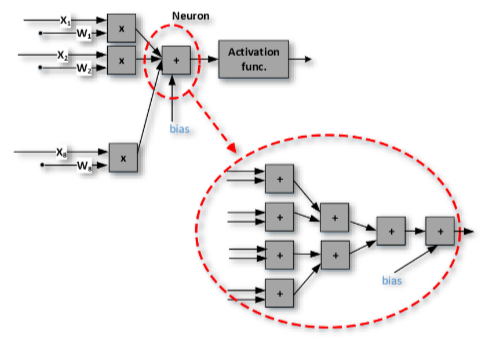
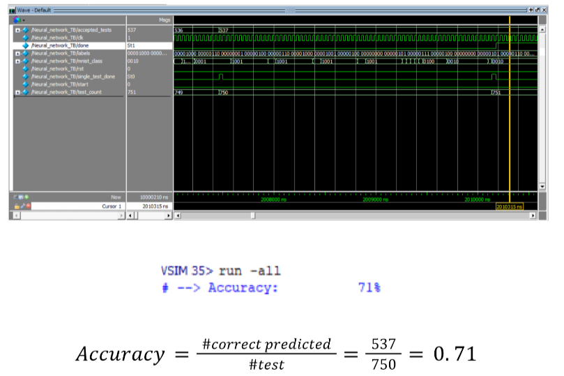

# Multi-Layer-Perceptron-Neural-Network-Hardware-Implementation

In this project, the goal is to implement a simple MLP (Multi-Layer Perceptron) model of neural networks.

**Multi-Layer Perceptron (MLP):** The most common form of neural networks is the Feed-Forward Multi-Layer Perceptron (MLP). A feed-forward neural network is an `ANN` wherein connections between the neurons do not form a cycle. An n-layer MLP consists of one input layer, n-2 intermediate (hidden layers), and one output layer. Each layer consists of a set of basic processing elements or neurons. An individual neuron is connected to several neurons in the previous layer, from which it receives data, and also it is connected to several neurons in the next layer, to which it sends data. Except for the input nodes, each neuron uses a nonlinear activation function.

In this project, you have to design and implement a simple MLP neural network in hardware. The neural network hardware is implemented as a set of processing units (PUs) and a controller. Each PUs is a multiply-and-accumulate unit that has eight inputs. It has eight multipliers, an adder tree, and an activation function. The `PU` architecture is shown below:

   
    
   
  <em>Fig. 1. PU Structure</em>

The MLP in this project has 62 inputs in the input layer, 10 output neurons in the output layer, and also one hidden layer with 30 neurons is considered for this issue. In both layers of our MLP model for `MNIST` classification, the `ReLU` function is considered as an activation function.

## Result

   
    
   

## Report
The report is available [here](https://github.com/parnianf/Multi-Layer-Perceptron-Neural-Network-Hardware-Implementation/blob/main/Report-English.pdf).

